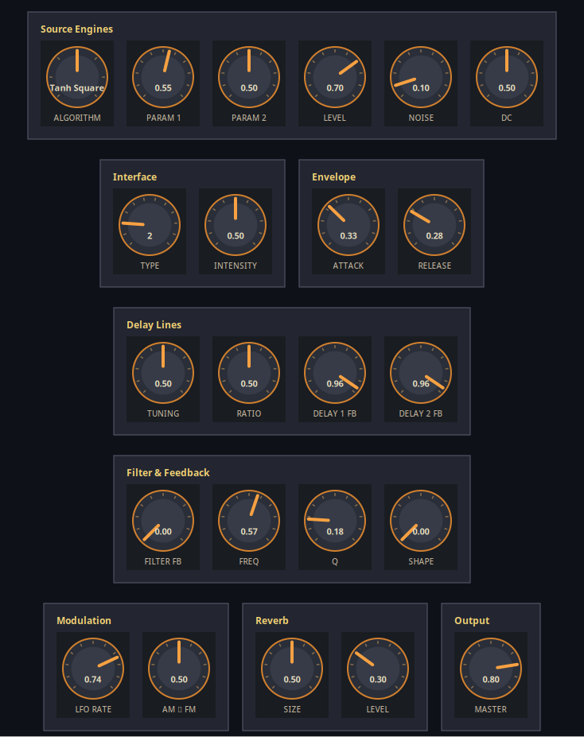

# flues

[Live synth experiments](https://danja.github.io/flues/)

First attempt was a physical modelling approach to clarinet. Second, a more general physical modelling setup. Third addition explores fairly obscure distortion synthesis techniques largely based on Victor Lazzarini’s [Distortion Synthesis tutorial in Csound Journal Issue 11](https://csoundjournal.com/issue11/distortionSynthesis.html), with a browser-based Disyn instrument covering DSF, waveshaping, and modified FM algorithms.

I typically work in a DAW (Reaper) so although the browser-based synths are usable from there, for convenience it made sense to port them into plugins. I work on Linux so LV2s were the obvious choice. At this point it occurred to me that it would also make sense to combine them, hence **Floozy** :

I'm aiming to put some of these things onto hardware (Daisy Seed) next. Good fun!

## Projects

### Stove
A modular physical modeling synthesizer featuring **12 interface types** (8 physical models + 4 hypothetical) with strategy pattern architecture.

Available in three implementations:

#### 1. Web App (Browser)
* **[Try it live](https://danja.github.io/flues/pm-synth/)**
* [Project README](experiments/pm-synth/README.md)
* Web Audio API with AudioWorklet processing
* PWA support for offline use
* Documentation:
  * [Implementation Plan](experiments/pm-synth/docs/PLAN.md)
  * [Implementation Status](experiments/pm-synth/docs/IMPLEMENTATION_STATUS.md)
  * [Interface Refactoring Summary](docs/interface-refactoring-summary.md)
  * [Interface Algorithms Research](docs/interface-algorithms-research.md)
  * [Signal Flow Documentation](docs/interface-signal-flow.md)
  * [Adding New Interfaces Guide](docs/adding-new-interface-guide.md)

#### 2. GTK4 Desktop App (Linux Native)
* **[Project README](gtk-synth/README.md)**
* Native C implementation with GTK4 interface
* PulseAudio backend with threaded processing
* All 12 interface strategies fully implemented
* Complete DSP engine matching JavaScript exactly
* Build: `cd gtk-synth && meson setup builddir && ninja -C builddir`

#### 3. LV2 Plugin: Stove Synth
* Source & docs: [`lv2/pm-synth/`](lv2/pm-synth)
* Root-level helper: `./build_synths.sh --clean --install-default`
  - Installs to `~/.lv2/pm-synth.lv2/`

**Features (all implementations):**
- 12 interface types: Pluck, Hit, Reed, Flute, Brass, Bow, Bell, Drum, Crystal, Vapor, Quantum, Plasma
- Modular DSP architecture (8 modules) with strategy pattern
- Real-time parameter control (18 parameters)
- High-fidelity physical modeling algorithms

### Clarinet Synth
Digital waveguide clarinet synthesizer - the original experiment that led to the PM Synth.

* **[Try it live](https://danja.github.io/flues/clarinet-synth/)**
* [Project README](experiments/clarinet-synth/README.md)

### Floozy (mono) and Floozy Poly
Hybrid LV2 instruments that graft Disyn's distortion algorithms onto the Stove physical-modelling engine. A Disyn source block feeds the Stove interface/delay/filter/modulation/reverb chain, giving aggressive spectra inside the resonant acoustic loop.

| Variant | Voices | Source | Notes |
| --- | --- | --- | --- |
| Floozy | 1 | [`lv2/floozy/`](lv2/floozy) | Original mono implementation |
| Floozy Poly | 8 | [`lv2/floozy-poly/`](lv2/floozy-poly) | Polyphonic fork of the dev engine |

* Plugin READMEs: [Floozy](lv2/floozy/README.md), [Floozy Poly](lv2/floozy-poly/README.md)
* Build helper: `./build_pm_synth.sh --install-default` (builds/distributes pm-synth, disyn, floozy bundles). For Floozy Poly, `cmake -S lv2/floozy-poly -B lv2/floozy-poly/build && cmake --build ... --target install`.

## Reference Materials
* [CLAUDE.md](CLAUDE.md) - Project guidelines and development practices
* [AGENTS Project Notes](AGENTS.md)
* Wikipedia: [Physical Modelling Synthesis](https://en.wikipedia.org/wiki/Physical_modelling_synthesis), [Digital waveguide synthesis](https://en.wikipedia.org/wiki/Digital_waveguide_synthesis), [Karplus-Strong Algorithm](https://en.wikipedia.org/wiki/Karplus%E2%80%93Strong_string_synthesis)
* [Physical Audio Signal Processing](http://ccrma.stanford.edu/~jos/pasp/) - Julius O. Smith III
