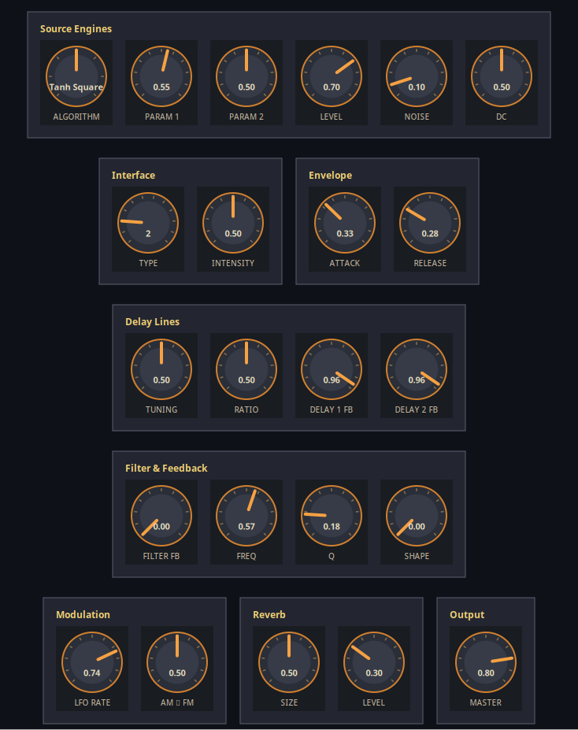

# flues

[Live synth experiments](https://danja.github.io/flues/)

First attempt was a physical modelling approach to clarinet. Second, a more general physical modelling setup. Third addition explores fairly obscure distortion synthesis techniques largely based on Victor Lazzarini’s [Distortion Synthesis tutorial in Csound Journal Issue 11](https://csoundjournal.com/issue11/distortionSynthesis.html), with a browser-based Disyn instrument covering DSF, waveshaping, and modified FM algorithms.

I typically work in a DAW (Reaper) so although the browser-based synths are usable from there, for convenience it made sense to port them into plugins. I work on Linux so LV2s were the obvious choice. At this point it occurred to me that it would also make sense to combine them, hence **Floozy** :

I'm aiming to put some of these things onto hardware (Daisy Seed) next. Good fun!

## Projects

### Stove
A modular physical modeling synthesizer featuring **12 interface types** (8 physical models + 4 hypothetical) with strategy pattern architecture.

Available in three implementations:

#### 1. Web App (Browser)
* **[Try it live](https://danja.github.io/flues/pm-synth/)**
* [Project README](experiments/pm-synth/README.md)
* Web Audio API with AudioWorklet processing
* PWA support for offline use
* Documentation:
  * [Implementation Plan](experiments/pm-synth/docs/PLAN.md)
  * [Implementation Status](experiments/pm-synth/docs/IMPLEMENTATION_STATUS.md)
  * [Interface Refactoring Summary](docs/interface-refactoring-summary.md)
  * [Interface Algorithms Research](docs/interface-algorithms-research.md)
  * [Signal Flow Documentation](docs/interface-signal-flow.md)
  * [Adding New Interfaces Guide](docs/adding-new-interface-guide.md)

#### 2. GTK4 Desktop App (Linux Native)
* **[Project README](gtk-synth/README.md)**
* Native C implementation with GTK4 interface
* PulseAudio backend with threaded processing
* All 12 interface strategies fully implemented
* Complete DSP engine matching JavaScript exactly
* Build: `cd gtk-synth && meson setup builddir && ninja -C builddir`

#### 3. LV2 Plugin: Stove Synth
* Source & docs: [`lv2/pm-synth/`](lv2/pm-synth)
* Root-level helper: `./build_synths.sh --clean --install-default`
  - Installs to `~/.lv2/pm-synth.lv2/`

**Features (all implementations):**
- 12 interface types: Pluck, Hit, Reed, Flute, Brass, Bow, Bell, Drum, Crystal, Vapor, Quantum, Plasma
- Modular DSP architecture (8 modules) with strategy pattern
- Real-time parameter control (18 parameters)
- High-fidelity physical modeling algorithms

### Chatterbox
Speech synthesis using formant filtering and source-filter vocal tract modeling.

Available in two implementations:

#### 1. Web App (Browser)
* **[Try it live](https://danja.github.io/flues/chatterbox/)**
* [Project README](experiments/chatterbox/README.md)
* Interactive IPA vowel quadrilateral joystick control
* Real-time F1-F4 formant manipulation
* Larynx (voiced) and aspirator (unvoiced) excitation sources

#### 2. LV2 Plugin: Chatterbox
* Source & docs: [`lv2/chatterbox/`](lv2/chatterbox)
* [Plugin README](lv2/chatterbox/README.md)
* Build: `cd lv2/chatterbox && cmake -S . -B build && cmake --build build && cmake --install build --prefix ~/.lv2`
* Native X11/Cairo UI with IPA vowel quadrilateral joystick
* Comprehensive MIDI control (note on/off, velocity, 17 CC mappings including CC 103/104 for speech synthesis)
* Vocal modes: Nasal, Sing (vibrato), Shout, Fry (vocal fry)
* Source control: Voiced (larynx) and Aspirated (noise) with MIDI CC support (CC 103/104)
* Built-in Schroeder reverb with size and level controls

### ChatGen
Text-to-speech MIDI generator that converts English text into MIDI events (Note On/Off + CCs) for controlling Chatterbox's formant speech synthesizer.

**LV2 Plugin:**
* Source & docs: [`lv2/chatgen/`](lv2/chatgen)
* [Plugin README](lv2/chatgen/README.md)
* Build: `cd lv2/chatgen && cmake -S . -B build && cmake --build build && cmake --install build --prefix ~/.lv2`
* Status: **Phase 2 Complete** - Full DSP engine with X11/Cairo UI
* Native X11/Cairo UI with text input and real-time phoneme preview
* Full phoneme support: 40+ phonemes (vowels, fricatives, plosives, nasals, liquids, affricates)
* Complete speech control: 7 MIDI CCs + Note On/Off generation
* Text persistence across UI focus changes and DAW restarts

**Features:**
- **Text input widget** with instant phoneme preview (e.g., "cat" → `[k] [ae] [t]`)
- **Full phoneme parsing**: 40+ IPA phonemes with digraph support (sh, ch, th, ee, oo, er, etc.)
- **MIDI Note generation**: Sends Note On (C4) when Play starts, Note Off when stops
- **7 MIDI CCs for complete speech control**:
  - CC 71, 10, 74, 75 (formants F1-F4)
  - CC 102 (Noise Level - 0-127 for fricative/plosive articulation)
  - CC 103 (Aspirated - noise generator on/off)
  - CC 104 (Voiced - larynx on/off for voiced vs unvoiced consonants)
- **Voiced/Unvoiced articulation**: Proper larynx control (vowels voiced, fricatives like f/s/sh unvoiced)
- **Half-note timing**: Each phoneme lasts 2 beats (1 second at 120 BPM, adjustable via DAW tempo)
- **Play/Loop controls** for sequence playback with DAW transport sync
- **Simple routing**: Place both plugins on same track: `[ChatGen] → [Chatterbox] → Audio Out`

**Usage Example:**
1. Type "cat dog fish" in ChatGen text input, press Enter
2. Click Play button (or start DAW transport)
3. Hear phonemes: `[k] [ae] [t] [d] [o] [g] [f] [ih] [sh]` with proper voiced/unvoiced transitions
4. Fricatives (f, sh) sound breathy, vowels (ae, o, ih) sound tonal

### Drumkit
Hardcore industrial drum synthesizer LV2 plugin with 8 voices inspired by the TR-909 but pushed into aggressive territory.

**LV2 Plugin:**
* Source & docs: [`lv2/drumkit/`](lv2/drumkit)
* [Plugin README](lv2/drumkit/README.md)
* Build: `cd lv2/drumkit && cmake -S . -B build && cmake --build build && cmake --install build --prefix ~/.lv2`
* Native X11/Cairo UI with 18 rotary knobs organized by drum type
* MIDI omni mode (responds to all channels)
* General MIDI note mapping (C2-D3, notes 36-50)

**Features:**
- **8 synthesized drum voices**: Kick, Snare, Clap, Lo Tom, Hi Tom, Closed HH, Open HH, Crash
- **18 parameters**: 4 for kick, 2 each for other drums, 4 for master FX
- **Velocity sensitivity**: Kick, snare, and toms respond to MIDI velocity
- **Hi-hat choke group**: Closed hi-hat (note 42) kills open hi-hat (note 46)
- **Master FX chain**: Bit crusher, distortion (tanh), Schroeder reverb
- **Industrial sound design**: Aggressive transients, metallic resonance, harsh harmonic content

**Drum Voices:**
- **Kick**: Pitch envelope + sine + distortion + punch (click burst)
- **Snare**: Dual resonators (180/330 Hz) + filtered noise
- **Clap**: Multi-impulse noise bursts with resonant bandpass (Q=4-8)
- **Toms**: Pitch envelope + resonant bandpass
- **Hi-Hats**: 6× inharmonic oscillators + ring modulation + noise
- **Crash**: Noise → 3× bandpass cascade → soft clipping

### Clarinet Synth
Digital waveguide clarinet synthesizer - the original experiment that led to the PM Synth.

* **[Try it live](https://danja.github.io/flues/clarinet-synth/)**
* [Project README](experiments/clarinet-synth/README.md)

### Floozy (mono) and Floozy Poly
Hybrid LV2 instruments that graft Disyn's distortion algorithms onto the Stove physical-modelling engine. A Disyn source block feeds the Stove interface/delay/filter/modulation/reverb chain, giving aggressive spectra inside the resonant acoustic loop.

| Variant | Voices | Source | Notes |
| --- | --- | --- | --- |
| Floozy | 1 | [`lv2/floozy/`](lv2/floozy) | Original mono implementation |
| Floozy Poly | 8 | [`lv2/floozy-poly/`](lv2/floozy-poly) | Polyphonic fork of the dev engine |

* Plugin READMEs: [Floozy](lv2/floozy/README.md), [Floozy Poly](lv2/floozy-poly/README.md)
* Build helper: `./build_pm_synth.sh --install-default` (builds/distributes pm-synth, disyn, floozy bundles). For Floozy Poly, `cmake -S lv2/floozy-poly -B lv2/floozy-poly/build && cmake --build ... --target install`.

### Flues Synth
**Headless Hybrid Speech/Physical Modeling Synthesizer for Raspberry Pi**

A standalone C/C++ ALSA MIDI synthesizer combining Disyn, Chatterbox, and PM-Synth architectures for headless Raspberry Pi deployment.

* **[Project README](flues-synth/README.md)**
* **[Signal Flow Diagram](flues-synth/docs/flues-synth-signal-flow.svg)**
* Source: [`flues-synth/`](flues-synth)
* Build: `cd flues-synth && meson setup builddir && meson compile -C builddir`
* Run: `./builddir/flues-synth hw:2,0`
* Status: **Phase 1 Complete** - Single voice with full MIDI control

**Key Features:**
- **Hybrid synthesis**: Disyn (7 algorithms) → Formants (F1-F4) → Interface (12 types) → Delays → Filter → Modulation
- **Dual DC blocking**: R=0.999 (-60dB @ DC) prevents feedback latching
- **Calibrated levels**: 0.28 peak output, safe with headroom
- **MIDI control**: 29 CCs + 6 control notes (36-41) for debug toggles
- **ALSA audio/MIDI**: Direct hardware access, 48kHz, 512 samples (~10ms latency)
- **Test suite**: engine-smoke, envelope-test, disyn-levels verify operation
- **Real-time feedback**: CC names printed on first occurrence

**Control Notes (36-41):**
- 36: Toggle Noise | 37: Toggle Disyn | 38: Toggle Feedback
- 39: Toggle Formants | 40: Toggle Filter | 41: Hard Mute (emergency)

**Use Cases:**
- Headless Pi synthesizer with MIDI controller
- Experimental sound design with hybrid synthesis
- Speech synthesis via formants + Disyn excitation
- Physical modeling with distortion-driven sources

## Reference Materials
* [CLAUDE.md](CLAUDE.md) - Project guidelines and development practices
* [AGENTS Project Notes](AGENTS.md)
* Wikipedia: [Physical Modelling Synthesis](https://en.wikipedia.org/wiki/Physical_modelling_synthesis), [Digital waveguide synthesis](https://en.wikipedia.org/wiki/Digital_waveguide_synthesis), [Karplus-Strong Algorithm](https://en.wikipedia.org/wiki/Karplus%E2%80%93Strong_string_synthesis)
* [Physical Audio Signal Processing](http://ccrma.stanford.edu/~jos/pasp/) - Julius O. Smith III
