# Digital Waveguide Clarinet Synthesizer

A real-time clarinet synthesizer based on digital waveguide physical modeling, running entirely in the browser using the Web Audio API.

## Overview

This synthesizer uses a **digital waveguide model** to physically simulate the acoustics of a clarinet. Unlike sample-based synthesis or simple oscillators, physical modeling recreates the actual physics of sound production, resulting in expressive, organic tones that respond naturally to parameter changes.



## How It Works

### Physical Model

A clarinet consists of three main components:
1. **Reed** - A nonlinear valve that modulates airflow based on pressure difference
2. **Bore** - A cylindrical tube that creates standing waves (modeled as a delay line)
3. **Excitation** - Breath pressure and turbulence noise

### Signal Flow

```
Breath Pressure + Noise → Reed Nonlinearity → Delay Line → Filters → Output
                              ↑                    ↓
                              └────────────────────┘
                                  Feedback Loop
```

#### 1. Excitation Generation
- **Breath Pressure**: Controlled by the Breath knob (0.4 - 0.8 range)
- **Noise**: White noise scaled by Noise knob (0 - 0.3), adds breath turbulence
- **Envelope**: ADSR envelope shapes the excitation over time

The excitation represents the mouthpiece pressure: `mouthPressure = breath × envelope + noise × envelope`

#### 2. Reed Reflection (Nonlinearity)

The reed is modeled as a nonlinear reflection function using a fast tanh approximation:

```
pressureDiff = mouthPressure - borePressure
flow = tanh(pressureDiff × stiffness)
```

The Reed Stiffness parameter (0-1) controls how the reed responds:
- **Low stiffness** (0): Soft, mellow tone - reed opens easily
- **High stiffness** (1): Bright, harsh tone - reed resists opening

This nonlinearity is crucial for creating the characteristic clarinet timbre with odd harmonics.

#### 3. Waveguide (Delay Line)

The bore is simulated using a delay line whose length is determined by pitch:

```
delayLength = sampleRate / frequency
```

- Linear interpolation provides fractional delay for accurate pitch
- Vibrato modulates the delay length: `length × (1 + vibrato × sin(phase))`
- The delay line acts as a comb filter, creating the harmonic series

#### 4. Feedback Mixing

The waveguide feedback combines bore pressure and reed flow:

```
newSample = borePressure + flow × 1.5
```

The flow gain of 1.5 provides strong reed coupling while maintaining stability.

#### 5. Loop Filters

Two filters shape the tone in the feedback loop:

**Lowpass Filter (Damping)**
- One-pole IIR filter: `y[n] = a × x[n] + (1-a) × y[n-1]`
- Cutoff: 0.3 - 0.99 (controlled by Damping knob)
- Simulates high-frequency loss in the bore
- Lower damping = darker, more muted tone

**Highpass Filter (Brightness)**
- DC blocker: prevents DC offset buildup
- Cutoff: 0.001 - 0.011 (controlled by Brightness knob)
- Higher brightness = removes more bass, thinner tone

#### 6. Soft Saturation

A tanh-like saturation function prevents runaway oscillations:

```
saturate(x) = x × (27 + x²) / (27 + 9x²)
```

Applied with a safety factor of 0.95 to keep the signal stable.

#### 7. Output Envelope

The final output is scaled by the envelope for natural attack and release characteristics.

## Controls

### Reed & Excitation

| Control | Range | Description |
|---------|-------|-------------|
| **Breath** | 0-100 | Breath pressure (0.4-0.8 internally). Higher = louder, more energy |
| **Reed Stiffness** | 0-100 | Reed compliance (0-1). Higher = brighter, more harmonics |
| **Noise** | 0-100 | Breath turbulence (0-0.3). Adds realistic air noise |
| **Attack** | 0-100 | Envelope attack time (0.001-0.1s). How quickly notes start |

### Bore & Resonance

| Control | Range | Description |
|---------|-------|-------------|
| **Damping** | 0-100 | Lowpass filter cutoff (0.3-0.99). Lower = darker tone |
| **Brightness** | 0-100 | Highpass filter amount (0.001-0.011). Higher = thinner, brighter |
| **Vibrato** | 0-100 | Pitch modulation depth (0-1%). Adds expressiveness |
| **Release** | 0-100 | Envelope release time (0.01-0.3s). How quickly notes fade |

### Keyboard

- **Mouse/Touch**: Click or touch the on-screen keys
- **Computer Keyboard**: Play notes using keys (AWSEDFTGYHUHJK)
- **Monophonic**: Only one note at a time (like a real clarinet)

## Technical Details

### Implementation

- **Audio Engine**: `ClarinetEngine.js` - Core DSP algorithms
- **Audio Processor**: `clarinet-worklet.js` - AudioWorklet for real-time processing
- **Sample Rate**: 44.1 kHz (standard)
- **Processing**: Per-sample digital waveguide simulation

### Browser Compatibility

- ✅ **Chrome/Edge**: Full support (AudioWorklet)
- ✅ **Firefox**: Full support (AudioWorklet)
- ✅ **Safari**: Full support (AudioWorklet)
- ⚠️ **iOS Safari**: Requires user interaction to start audio

### Performance

- **CPU Usage**: ~5-15% (single core) depending on parameters
- **Latency**: <10ms with AudioWorklet
- **Memory**: ~1-2 MB

## Theory Background

### Why Physical Modeling?

Physical modeling has several advantages:
- **Expressive**: Parameters behave like real instruments
- **Compact**: No large sample libraries needed
- **Flexible**: Can create sounds impossible with real instruments
- **Educational**: Demonstrates acoustic physics principles

### Clarinet Acoustics

Key characteristics:
- **Closed tube**: Clarinet acts as a closed cylindrical tube (reed closes one end)
- **Odd harmonics**: Produces primarily odd-numbered harmonics (1st, 3rd, 5th, etc.)
- **Nonlinear reed**: Creates rich harmonic content through amplitude-dependent behavior
- **Register holes**: Real clarinets use register holes to jump octaves (not implemented here)

### Digital Waveguide Synthesis

Invented by Julius O. Smith III at Stanford (CCRMA), digital waveguide synthesis models wave propagation in acoustic systems:

- **Delay lines** represent wave travel time
- **Filters** simulate energy loss and dispersion
- **Nonlinearities** create harmonic complexity
- **Feedback** maintains oscillation

This technique is computationally efficient and physically accurate, making it ideal for real-time synthesis.

## Development

### Running Locally

```bash
npm install
npm run dev
```

Open http://localhost:5173 in your browser.

### Building

```bash
npm run build
```

Output is in the `dist/` directory.

### Testing

```bash
npm test
```

## Architecture Files

- **Mermaid Diagram**: `docs/architecture.mmd` - Editable flow diagram
- **SVG Diagram**: `docs/architecture.svg` - Rendered block diagram

To regenerate the SVG from the mermaid file:
```bash
npx @mermaid-js/mermaid-cli -i docs/architecture.mmd -o docs/architecture.svg
```

## Project Structure

```
clarinet-synth/
├── docs/
│   ├── architecture.mmd      # Mermaid block diagram
│   └── architecture.svg       # Rendered SVG diagram
├── src/
│   ├── audio/
│   │   ├── ClarinetEngine.js      # Core DSP algorithms
│   │   ├── clarinet-worklet.js    # AudioWorklet processor
│   │   └── ClarinetProcessor.js   # Web Audio API interface
│   ├── ui/
│   │   ├── KnobController.js      # Rotary knob controls
│   │   ├── KeyboardController.js  # Musical keyboard
│   │   └── Visualizer.js          # Waveform display
│   └── main.js                # Application entry point
├── index.html               # HTML entry
├── package.json            # Dependencies
└── README.md              # This file
```

## References

- Smith, J.O. "Physical Modeling Using Digital Waveguides", Computer Music Journal, 1992
- Karjalainen, M. "Plucked-string models: From the Karplus-Strong algorithm to digital waveguides and beyond", Computer Music Journal, 1998
- Välimäki, V. "Discrete-time modeling of acoustic tubes using fractional delay filters", Helsinki University of Technology, 1995

## Future Enhancements

Potential improvements:
- [ ] Polyphony (multiple notes simultaneously)
- [ ] Register hole simulation (octave key)
- [ ] Tone hole modeling (realistic fingering)
- [ ] MIDI input support
- [ ] Preset system
- [ ] Recording/export functionality
- [ ] Spectral analysis display
- [ ] Touch-sensitive breath control

## License

See parent project for license information.
