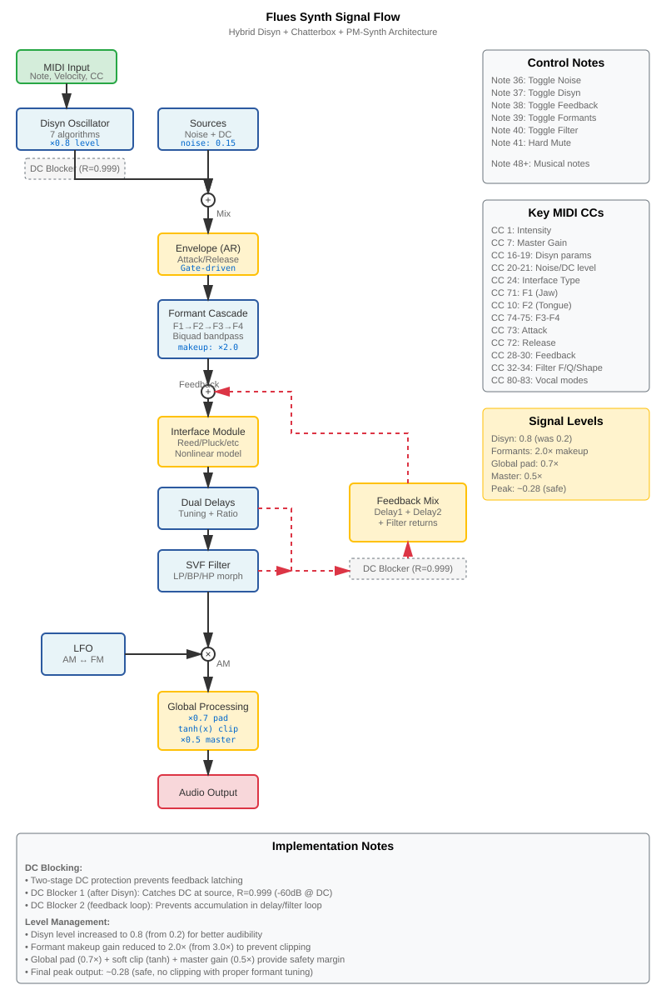

# Flues-Synth

**Headless Hybrid Speech/Physical Modeling Synthesizer for Raspberry Pi**

Unified polyphonic synthesizer combining Disyn distortion algorithms, Chatterbox formant synthesis, and PM-Synth physical modeling. Designed for headless operation on Raspberry Pi 4 with MIDI control.

## Features

- **Disyn Oscillators**: 7 distortion synthesis algorithms (Dirichlet Pulse, DSF, Tanh, PAF, Modified FM)
- **Chatterbox Formants**: 4-formant cascade (F1-F4) with nasal resonance and vocal modes (Sing, Shout, Nasal, Fry)
- **PM-Synth Physical Modeling**: 12 interface strategies (Pluck, Hit, Reed, Flute, Brass, Bow, Bell, Drum, Crystal, Vapor, Quantum, Plasma)
- **Dual DC Blocking**: Prevents feedback latching with -60dB DC rejection
- **Calibrated Signal Levels**: Safe 0.28 peak output with headroom for dynamics
- **ALSA Audio**: Direct PCM output (48kHz, 512 samples, ~10ms latency)
- **ALSA MIDI**: Auto-connects to best external MIDI port on startup
- **Headless Control**: Comprehensive MIDI CC mapping (29 parameters + 6 control notes)
- **Single Voice**: Phase 1 implementation (polyphony coming in Phase 2)

## Signal Flow



### Detailed Signal Path

```
MIDI Input (Note + 29 CCs)
  ↓
Disyn Oscillators (7 algorithms, ×0.8 level)
  ↓
[DC Blocker 1] (R=0.999, catches DC at source)
  ↓
Sources (Noise 0.15 + DC) → Mix
  ↓
Envelope (AR, exponential time mapping, gate-driven)
  ↓
Chatterbox Formants (F1→F2→F3→F4 cascade, ×2.0 makeup)
  ↓
+ Feedback ← [DC Blocker 2] ← Feedback Mix ← Delay1/2 + Filter
  ↓
Interface Strategy (12 physical models, nonlinear)
  ↓
Dual Delay Lines (pitch-tracked with tuning/ratio)
  ↓
State-Variable Filter (LP/BP/HP morph, Q control)
  ↓
× AM Modulation (LFO bipolar AM↔FM)
  ↓
Global Processing (×0.7 pad → tanh clip → ×0.5 master)
  ↓
ALSA Audio Out (peak ~0.28, safe margin)
```

### Key Architecture Features

- **Dual DC Blocking**: R=0.999 (-60dB @ DC, -3dB @ 7.6 Hz)
  - DC Blocker 1 after Disyn: Catches DC at source
  - DC Blocker 2 on feedback path: Prevents loop accumulation
- **Level Management**:
  - Disyn level: 0.8 (user adjustable via CC 19)
  - Formant makeup: 2.0× (compensates for Q-induced attenuation)
  - Global pad: 0.7× + soft clip (tanh) + master 0.5×
  - Final peak: ~0.28 (safe, no clipping)
- **Debug Toggles**: MIDI notes 36-41 toggle DSP sections

## Requirements

### Raspberry Pi 4
- Raspberry Pi OS (64-bit recommended)
- 2GB+ RAM

### Dependencies
```bash
sudo apt update
sudo apt install build-essential meson ninja-build libasound2-dev
```

## Build Instructions

### Basic Build
```bash
cd flues-synth
meson setup builddir
meson compile -C builddir
```

### Configuration Options

**Set voice count** (default: 4):
```bash
meson setup builddir -Dmax_voices=8
meson compile -C builddir
```

**Enable ARM NEON optimizations** (Raspberry Pi 4):
```bash
meson setup builddir -Denable_simd=true
meson compile -C builddir
```

**Change audio device** (run-time):
```bash
./builddir/flues-synth hw:1,0
```

### Clean Build
```bash
rm -rf builddir
meson setup builddir
meson compile -C builddir
```

## Running

### Start the Synthesizer
```bash
cd flues-synth
./builddir/flues-synth
```

Expected output:
```
=== Flues-Synth v0.1.0 ===
Unified Polyphonic Synthesizer (Phase 1: Single Voice)
Target: Raspberry Pi 4 (ARM Cortex-A72)

Audio device: default
Sample rate: 48000 Hz
Buffer size: 256 frames (5.3 ms)

Synth engine initialized
MIDI: Found port 20:0 'USB MIDI Device' (score: 18)
MIDI: Auto-connected to port 20:0
MIDI: Initialized (client ID: 128, port: 0)

=== Flues-Synth Running ===
Listening for MIDI input...
Press Ctrl+C to quit
```

### Manual MIDI Connection

If no MIDI device is found, connect manually:

```bash
# List ALSA MIDI ports
aconnect -l

# Connect your MIDI device to Flues-Synth
aconnect 20:0 128:0
```

### MIDI Feedback

The synth prints CC names on first occurrence:

```
CC ch1: 20 -> 64  [Noise Level]
CC ch1: 71 -> 45  [F1 (Jaw)]
CC ch1: 20 -> 65
CC ch1: 20 -> 66
```

After the first move of each CC, subsequent values show only numbers for cleaner console output.

### Stop the Synthesizer
Press `Ctrl+C` for clean shutdown.

## Audio Device Setup

### Using a USB DAC

To use an external USB DAC instead of the built-in audio output:

**1. Detect Available Audio Devices**

List all playback hardware devices:
```bash
aplay -l
```

Example output:
```
card 0: Headphones [bcm2835 Headphones], device 0: bcm2835 Headphones [bcm2835 Headphones]
card 2: DAC [USB Audio DAC], device 0: USB Audio [USB Audio]
```

In this example, the USB DAC is `hw:2,0` (card 2, device 0).

**2. List Device Names (Including Plugin Devices)**

```bash
aplay -L
```

Shows additional options:
- `hw:X,Y` - Direct hardware access
- `plughw:X,Y` - Hardware with automatic format conversion
- `default:CARD=XXX` - Named card reference

**3. Test the USB DAC**

Generate a test tone to verify the device works:
```bash
# Mono test on hw:2,0
speaker-test -D hw:2,0 -c 1 -t sine

# Stereo test
speaker-test -D hw:2,0 -c 2 -t sine
```

Press Ctrl+C to stop the test.

**4. Run Flues-Synth with USB DAC**

Pass the device as a command-line argument:
```bash
./builddir/flues-synth hw:2,0
```

**5. Set USB DAC as Default (Optional)**

To make the USB DAC the system default, create or edit `~/.asoundrc`:
```bash
nano ~/.asoundrc
```

Add:
```
pcm.!default {
    type hw
    card 2
    device 0
}
```

Then run flues-synth without arguments:
```bash
./builddir/flues-synth
```

**6. Check Active Audio**

See which devices are currently in use:
```bash
cat /proc/asound/pcm
```

### Audio Device Auto-Detection

If no device is specified, flues-synth tries these in order:
1. Command-line argument (e.g., `hw:2,0`)
2. `hw:Headphones` (Raspberry Pi headphone jack)
3. `plughw:Headphones`
4. `hw:2,0` (common USB DAC location)
5. `plughw:2,0`
6. `hw:1,0`
7. `default`

Override with: `./builddir/flues-synth <device-name>`

## MIDI Control

### Control Notes (36-42) - Debug Toggles

Special MIDI notes toggle DSP sections for diagnostics and isolation:

| Note | Function | Description |
|------|----------|-------------|
| 36 | Toggle Noise | Enable/disable white noise source |
| 37 | Toggle Disyn | Enable/disable Disyn oscillator |
| 38 | Toggle Feedback | Enable/disable feedback loop |
| 39 | Toggle Formants | Enable/disable formant cascade |
| 40 | Toggle Filter | Enable/disable SVF filter |
| 41 | Hard Mute | Emergency mute (clears delays, DC blockers, filters) |
| 42 | Reset | Reset all parameters to defaults and clear all notes |
| 48+ | Musical Notes | Standard MIDI note range (C3 = 48) |

**Usage:** Press any of notes 36-42 to toggle or reset. Console shows:
```
Ctl Note 36: Noise ENABLED
Ctl Note 37: Disyn DISABLED
```

### MIDI CC Mapping

#### Standard Controls
| CC  | Parameter       | Range         | Description                    |
|-----|-----------------|---------------|--------------------------------|
| 1   | Intensity       | 0-1           | Interface intensity (mod wheel)|
| 7   | Master Gain     | 0-1           | Output volume                  |
| 10  | F2 (Tongue)     | 500-3000 Hz   | Second formant frequency       |
| 71  | F1 (Jaw)        | 200-1000 Hz   | First formant frequency        |
| 72  | Release         | 0-1           | Envelope release time          |
| 73  | Attack          | 0-1           | Envelope attack time           |
| 74  | F3 (Lips)       | 1500-4000 Hz  | Third formant frequency        |
| 75  | F4 (Quality)    | 2500-4500 Hz  | Fourth formant frequency       |

### Vocal Modes (Toggle: ≥64 = ON)
| CC  | Parameter | Description                              |
|-----|-----------|------------------------------------------|
| 80  | Nasal     | Enable nasal formant (250 Hz)           |
| 81  | Sing      | Vibrato (5.5 Hz ±1.5%)                  |
| 82  | Shout     | 15% formant frequency boost             |
| 83  | Fry       | Vocal fry (f₀/2 subharmonic)            |

### Disyn Source
| CC  | Parameter     | Range   | Description                |
|-----|---------------|---------|----------------------------|
| 16  | Algorithm     | 0-6     | Disyn synthesis algorithm  |
| 17  | Param1        | 0-1     | Algorithm parameter 1      |
| 18  | Param2        | 0-1     | Algorithm parameter 2      |
| 19  | Disyn Level   | 0-1     | Oscillator mix level       |
| 20  | Noise Level   | 0-1     | White noise mix level      |
| 21  | DC Level      | 0-1     | DC offset mix level        |

### Interface & Delay
| CC  | Parameter       | Range        | Description                    |
|-----|-----------------|--------------|--------------------------------|
| 24  | Interface Type  | 0-11         | Physical model (see below)     |
| 26  | Tuning          | -12 to +12   | Delay line pitch offset        |
| 27  | Ratio           | 0.5 to 2.0   | Delay2/Delay1 length ratio     |

### Feedback
| CC  | Parameter         | Range | Description                    |
|-----|-------------------|-------|--------------------------------|
| 28  | Delay1 Feedback   | 0-1   | First delay return level       |
| 29  | Delay2 Feedback   | 0-1   | Second delay return level      |
| 30  | Filter Feedback   | 0-1   | Filter output return level     |

### Filter
| CC  | Parameter     | Range          | Description                |
|-----|---------------|----------------|----------------------------|
| 32  | Frequency     | 20-20000 Hz    | Filter cutoff frequency    |
| 33  | Q             | 0.1-10         | Filter resonance           |
| 34  | Shape         | 0-1            | LP (0) → BP (0.5) → HP (1) |

### Modulation
| CC  | Parameter    | Range         | Description                     |
|-----|--------------|---------------|---------------------------------|
| 36  | LFO Freq     | 0.1-20 Hz     | Modulation LFO frequency        |
| 37  | AM ↔ FM      | -1 to +1      | AM (-1) ↔ None (0) ↔ FM (+1)   |

## Interface Types

| ID  | Name     | Description                        | Character                    |
|-----|----------|------------------------------------|------------------------------|
| 0   | Pluck    | Karplus-Strong plucked string     | Bright, metallic attack      |
| 1   | Hit      | Struck/mallet percussion          | Sharp transient, decay       |
| 2   | Reed     | Clarinet-style reed instrument    | Woody, breathy               |
| 3   | Flute    | Jet-edge aerophone                | Airy, hollow                 |
| 4   | Brass    | Lip-buzz brass instrument         | Buzzy, brassy                |
| 5   | Bow      | Bowed string (friction)           | Sustained, singing           |
| 6   | Bell     | Metallic resonator                | Bright, ringing              |
| 7   | Drum     | Membrane percussion               | Thuddy, resonant             |
| 8   | Crystal  | Golden-ratio coupled oscillators  | Glassy, shimmering           |
| 9   | Vapor    | Chaotic turbulent flow            | Unstable, evolving           |
| 10  | Quantum  | Phase-locked harmonic coupling    | Metallic, interference       |
| 11  | Plasma   | Amplitude-driven energy feedback  | Aggressive, growling         |

## Disyn Algorithms

| ID  | Name              | Description                              |
|-----|-------------------|------------------------------------------|
| 0   | Dirichlet Pulse   | Sum of harmonics (Param1: harmonics)     |
| 1   | DSF Single        | Discrete summation formula               |
| 2   | DSF Double        | Two DSF oscillators (Param2: detune)     |
| 3   | Tanh Square       | Waveshaped square wave                   |
| 4   | Tanh Saw          | Waveshaped sawtooth wave                 |
| 5   | PAF               | Phase-aligned formant                    |
| 6   | Modified FM       | Phase-modulated FM synthesis             |

## Troubleshooting

### No Audio Output

1. **Check Disyn level**: Default 0.8, boost via CC 19 if needed
2. **Check Master gain**: Default 0.5, boost via CC 7 if needed
3. **Verify parts not toggled off**: Use notes 36-41 to check status
4. **Test audio device**:
   ```bash
   # List audio devices
   aplay -l

   # Test device
   speaker-test -D default -c 1

   # Try different device
   ./builddir/flues-synth hw:1,0
   ```

### Low Output Level

If output is too quiet with only Disyn enabled (formants/feedback off):

1. **Boost Disyn level**: CC 19 to 100-127 (0.78-1.0)
2. **Boost Master gain**: CC 7 to 100-127
3. **Reason**: Default levels (0.8 Disyn, 0.5 master) are calibrated for full signal chain

### Clipping/Distortion

1. **Reduce Disyn level**: CC 19 to 30-60 (0.24-0.47) when using formants
2. **Turn off Shout mode**: CC 82 < 64 (15% boost can cause clipping)
3. **Lower feedback**: Reduce CC 28-30 (delay/filter returns)
4. **Check formant tuning**: Extreme F1-F4 values can cause resonance buildup

### DC Offset / Audio Lockup

If audio locks up or produces continuous tone:

1. **Hard mute**: Press MIDI note 41 (clears delays, DC blockers, filters)
2. **Disable feedback**: Press note 38 to isolate feedback loop
3. **Check DC level**: CC 21 should be 0 (no DC injection)
4. **Restart synth**: DC blockers reset on note on, but hard mute is faster

**DC Blocking Protection:**
- Two-stage DC blocking (R=0.999, -60dB @ DC)
- DC Blocker 1 after Disyn catches source DC
- DC Blocker 2 on feedback prevents loop accumulation
- Hard mute (note 41) resets all DC blockers

### No MIDI Connection
```bash
# List MIDI ports
aconnect -l

# Check if device is detected
cat /proc/asound/cards

# Manual connection
aconnect <source-port> <flues-synth-port>
```

### Buffer Underruns (ALSA XRUN)
- Increase buffer size in `include/config.h`:
  ```c
  #define DEFAULT_BUFFER_SIZE 1024  // Increase from 512
  ```
- Rebuild: `meson compile -C builddir`

### High CPU Usage
- Disable ARM optimizations: `meson setup builddir -Denable_simd=false`
- Reduce voice count: `meson setup builddir -Dmax_voices=1`
- Lower sample rate to 44100 Hz in `config.h`

### Build Errors
```bash
# Clean build
rm -rf builddir
meson setup builddir
meson compile -C builddir

# Check dependencies
dpkg -l | grep -E 'meson|ninja|alsa'
```

## Performance

**Raspberry Pi 4 (Cortex-A72):**
- Single voice: ~5-10% CPU @ 48kHz
- Target (4 voices): ~20-30% CPU
- Latency: ~5.3ms (256 samples)

## Testing

Three test suites verify correct operation:

```bash
# Run all tests
meson test -C builddir

# Individual tests
./builddir/engine-smoke    # Basic signal generation (RMS check)
./builddir/envelope-test   # Envelope attack/sustain/release
./builddir/disyn-levels    # Disyn algorithm level analysis
```

**Expected output:**
```
1/3 engine-smoke  OK    (RMS: 0.019+, verifies non-zero output)
2/3 envelope-test OK    (attack/sustain/release phases detected)
3/3 disyn-levels  OK    (all 7 algorithms within safe bounds)
```

**Smoke Test Details:**
- Renders 1 second of audio with default settings
- Measures RMS level of last 0.5 seconds
- Verifies RMS > 0.01 (signal present, not zero)
- Catches DC blocker issues, envelope failures, signal path breaks

**Envelope Test Details:**
- Tests note on triggers envelope attack
- Verifies sustained tone has stable output
- Tests note off triggers release decay
- Tests rapid note retriggering (5 cycles)

**Disyn Levels Test Details:**
- Measures peak/RMS for all 7 algorithms
- Sweeps Param1/Param2 across full ranges
- Verifies peaks within safe bounds (<2.2)
- Reports clipping warnings if any

## Notes for Raspberry Pi Deployment

- The app auto-falls back through common Pi audio devices if no CLI device given: `hw:Headphones`, `plughw:Headphones`, `hw:2,0`, `plughw:2,0`, `hw:1,0`, then `default`
- Override with: `./builddir/flues-synth hw:2,0`
- Quick rebuild on Pi: `meson setup builddir --reconfigure && meson compile -C builddir && meson test -C builddir`
- Enable MIDI debug: `FLUES_MIDI_DEBUG=1 ./builddir/flues-synth hw:2,0`


## Architecture

```
flues-synth/
├── include/
│   ├── config.h                    # Build-time configuration
│   ├── dsp_modules.h               # Module interfaces
│   ├── dsp_utils.h                 # DSP utilities
│   ├── synth_engine.h              # Main coordinator
│   ├── audio_backend_alsa.h        # ALSA audio
│   └── midi_backend_alsa.h         # ALSA MIDI
├── src/
│   ├── main.c                      # Entry point + CC mapping
│   ├── synth_engine.c              # Voice management + signal flow
│   └── audio/
│       ├── audio_backend_alsa.c    # ALSA PCM output
│       ├── midi_backend_alsa.c     # ALSA sequencer input
│       └── modules/
│           ├── disyn_wrapper.cpp   # C++ Disyn → C interface
│           ├── sources_module.c    # Noise + DC
│           ├── envelope_module.c   # Attack/Release
│           ├── formant_module.c    # Biquad bandpass filter
│           ├── formant_bank_module.c # 4-formant cascade
│           ├── interface_module.c  # Strategy pattern
│           ├── delay_lines_module.c # Dual delays
│           ├── feedback_module.c   # 3-way mixer
│           ├── filter_module.c     # State-variable filter
│           ├── modulation_module.c # LFO
│           └── strategies/         # 12 interface implementations
├── meson.build                     # Build configuration
├── meson_options.txt               # Build options
└── README.md                       # This file
```

## Documentation

- **[Signal Flow Diagram](docs/flues-synth-signal-flow.svg)** - Visual architecture with signal levels
- **[Handover Document](docs/flues-synth-handover.md)** - Original implementation notes and design decisions
- **[Envelope Fix](docs/envelope-fix-2025-12-05.md)** - DC blocker optimization (removed output blocker)
- **[Level Analysis](docs/disyn-level-analysis.md)** - Signal level calibration and test results
- **[DC Blocking Protection](docs/dc-blocking-protection.md)** - Feedback latch prevention strategy
- **[Level Fix Verification](docs/level-fix-verification.md)** - Before/after measurements

## Development Roadmap

### Phase 1 (Current) ✅
- ✅ Single-voice operation
- ✅ Disyn + Chatterbox + PM-Synth integration
- ✅ ALSA audio/MIDI backends with auto-connect
- ✅ 29 MIDI CC controls with name printing
- ✅ 6 control notes for debug toggles
- ✅ Dual DC blocking protection
- ✅ Calibrated signal levels (0.28 peak)
- ✅ Test suite (engine-smoke, envelope-test, disyn-levels)

### Phase 2 (Next)
- ☐ 4-voice polyphony
- ☐ Voice allocation and stealing
- ☐ Per-voice parameter management
- ☐ Polyphonic aftertouch

### Phase 3 (Future)
- ☐ GTK4 UI (optional)
- ☐ MIDI learn
- ☐ Preset system
- ☐ Performance profiling

## Recent Changes

### 2025-12-05: Signal Level & DC Blocking Fixes
- **Removed aggressive output DC blocker** (was killing envelope attack)
- **Optimized to dual DC blocking** (source + feedback loop, R=0.999)
- **Increased default noise level** (0.02 → 0.15) for formant excitation
- **Reduced formant makeup gain** (3.0× → 2.0×) to prevent Disyn clipping
- **Boosted master gain** (0.35 → 0.5) and global pad (0.5 → 0.7)
- **Increased Disyn level** (0.2 → 0.8) for better audibility
- **Added CC name printing** on first occurrence for each controller
- **All 3 test suites passing** (engine-smoke, envelope-test, disyn-levels)

### 2025-12-04: Initial Implementation
- Merged Disyn + Chatterbox + PM-Synth architectures
- Implemented triple DC blocking (later reduced to dual)
- Created test suite for signal verification
- Calibrated signal levels to prevent clipping

## License

Part of the Flues project. See main repository for license information.

## Related Projects

- **experiments/disyn**: JavaScript distortion synthesizer
- **experiments/chatterbox**: JavaScript formant speech synthesizer
- **experiments/pm-synth**: JavaScript physical modeling synthesizer
- **lv2/disyn**: Disyn LV2 plugin
- **lv2/chatterbox**: Chatterbox LV2 plugin
- **lv2/floozy**: Hybrid Disyn+PM LV2 plugin
- **gtk-synth**: GTK4 desktop PM-Synth

## Credits

- **Disyn**: Distortion synthesis algorithms
- **Chatterbox**: Formant synthesis and vocal modes
- **PM-Synth**: Physical modeling framework
- Built with: Meson, ALSA, C11/C++17
