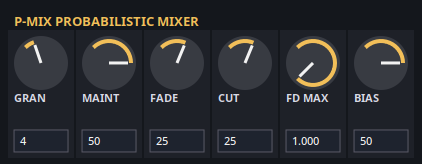

# P-Mix



P-Mix is a probabilistic mixer LV2 effect that toggles audio on or off at bar boundaries. It is designed for rhythmic dropouts, probabilistic mutes, and DJ-style track cycling across up to eight channels within a track.

## Quick Start

1. Insert P-Mix on an audio track or bus.
2. Start your DAW transport (P-Mix uses bar/tempo information).
3. Set Granularity to decide how often the plugin can switch state.
4. Use Maintain/Fade/Cut to shape the behavior.
5. Set Bias to target the overall play ratio.

If the transport is stopped or the host does not send bar timing, P-Mix will not transition and the signal stays on.

## Controls

- Granularity (1-32 bars)
  How often decisions are made. 1 means every bar, 4 means every 4 bars.
- Maintain (0-100)
  Weight to keep the current state.
- Fade (0-100)
  Weight to fade to the next target state.
- Cut (0-100)
  Weight to instantly switch to the next target state.
- Fade Dur Max (0.125-1.0)
  Maximum fade length as a fraction of the decision window. The actual fade is randomized between 12.5% and this value.
- Bias (0-100)
  Target long-term play ratio. Example: Bias 70 aims for the track to be audible about 70% of the time on average.

Notes:
- Maintain/Fade/Cut are normalized, so only the relative weights matter.
- Bias chooses the target state at each decision point, independent of Maintain/Fade/Cut.

## Example Settings

- Subtle movement: Granularity 4, Maintain 70, Fade 25, Cut 5, Bias 60
- Glitchy chops: Granularity 1, Maintain 20, Fade 30, Cut 50, Bias 50
- Sparse dropouts: Granularity 8, Maintain 60, Fade 20, Cut 20, Bias 40

## Build & Install

From the repo root:

```sh
cmake -S lv2/p-mix -B lv2/p-mix/build
cmake --build lv2/p-mix/build
cmake --install lv2/p-mix/build --prefix ~/.lv2
```

Dependencies:
- LV2 headers
- X11 + Cairo (for the UI)
- CMake + a C/C++ toolchain

## Troubleshooting

- No changes happen: verify the DAW transport is running and sending tempo/bar info.
- Abrupt transitions: increase Fade or reduce Cut, and consider a longer Fade Dur Max.
- UI does not open: verify `libx11` and `libcairo` are installed.

## Development Notes

- DSP entry point: `lv2/p-mix/src/p_mix_plugin.cpp`
- UI: `lv2/p-mix/src/ui/p_mix_ui_x11.c`
- LV2 metadata: `lv2/p-mix/p-mix.lv2/p-mix.ttl`
- State support saves parameters under `PMIX_URI` keys.
- Transitions happen at bar boundaries based on LV2 Time position events.
